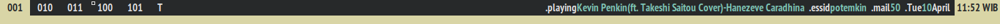

# getstat

fetch and print status info on dwm bar, the codes are mainly cherry picked from the [suckless](https://dwm.suckless.org/dwmstatus/) repo

## Requirements
in order to compile `getstat` you need the following dependencies :
- Xlib header files  
- `libmpdclient`

### extra dependencies
- dwm with statuscolors patch
- mail/inbox directory of your favorite offline mail client
- powerline font, set it as fallback fonts on your dwm/config.h

## Features
- mpd status (Playing, Paused, Stopped, and Unavailable)
- wifi essid
- inbox/mail counter
- date and time

## Preview



## Installation
- edit `config.h` to suit your local setup and run (as root if necessary) :
```
make
make clean install     
```

- or you can just copy/move the generated `getstat` binary into your `$PATH`
```
make
mv getstat /your/PATH/directory/getstat
```

- testing run :
```
make
./getstat
```


## License
This software is licensed under GNU General Public License v3.0 - see [LICENSE](LICENSE) for detailed information


